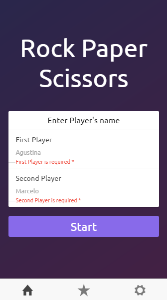
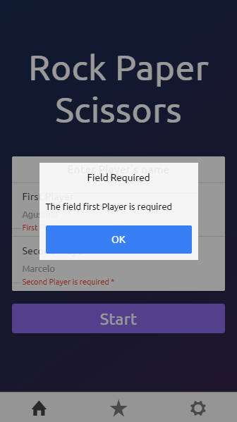
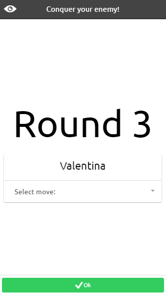
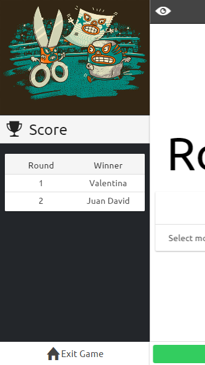
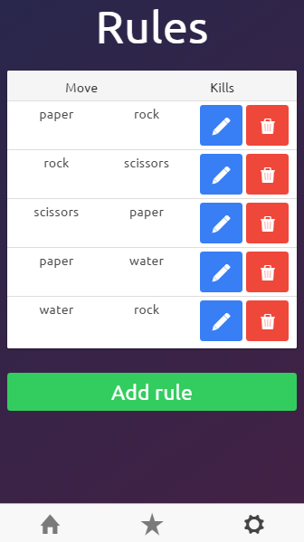

# Game of Drones
Conquer your enemy!

  
## **Synopsis**

In Game of Drones there are two players trying to conquer each other.

Players take turns to make their move, choosing Paper, Rock or Scissors. Each move beats another, just like the game “Paper, rock, scissors”.

Like so:

* Paper beats Rock
* Rock beats scissors
* Scissors beat Paper

###**Note**: The first player to beat the other player 3 times wins the battle.

## **Installation**

   * Install **[Node.js](https://nodejs.org)**.
   * Install **[MongoDB](https://www.mongodb.com/)**.
   
  ### **1. FrontEnd**:

  * To run the application on browser, you can execute the following commands using CLI:
    - npm install
    - gulp
    - ionic serve

  * To run the application on mobile devices via USB, you can execute the following commands using CLI:

    **On Android**
      - ionic platform add android
      - ionic run android

    **On iOS (Mac)**
      - ionic platform add ios
      - ionic run ios

    *To debug the application, you can use some tools:*
      - **[GapDebug](https://www.genuitec.com/products/gapdebug/)**
      - **[Ionic View App](http://view.ionic.io/)**
      
  ### **2. BackEnd**:
  
   * To run the application using CLI, you can execute the following commands:
    - npm install
    - npm start

    *To debug the application, you can use:*
      - **[Visual Studio Code](https://code.visualstudio.com/)**
      
## Template Structure

  Path         | Explanation
  ----------   | -------------
  `./app/img/` | Images in the app.
  `./app/js/`  | Scripts (Controllers, Services, Directives, etc).
  `./app/scss/` | The styles of the app using Sass.
  `./app/templates/` | Views in the app.
  `./app/index.html` | The init page.
  `./www/css/` | Other css styles like **[Animate.css](https://daneden.github.io/animate.css/)**, etc.
  `./www/lib` | Scripts downloaded using bower.
  
## Tests

**1. Unit Tests With Jasmine & Karma**:
 
  To run the unit tests, you can execute the following commands using CLI:
  
  * cd tests
  * karma start unit-tests.conf.js

**2. End-To-End Tests With Jasmine & Protractor**:
 
  * To run the E2E tests on Chrome, you can execute the following commands using CLI:
    - ionic serve --nobrowser

  * Using another command line
    - cd tests
    - protractor e2e-tests.conf.js

## Happy coding
Made with <3

